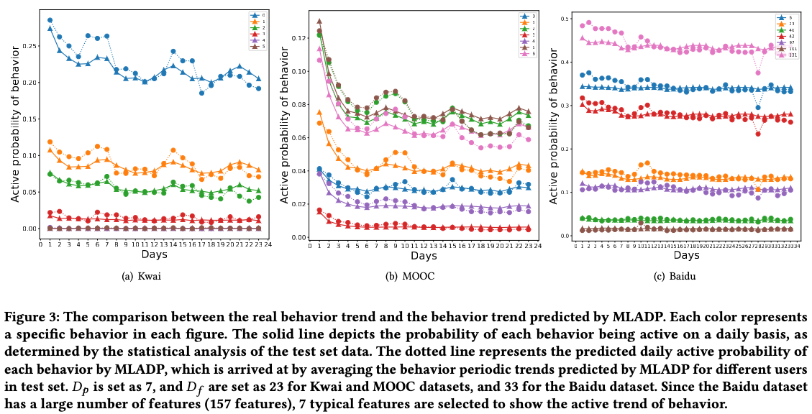

# A Multi-Task Model for Long-Term Active Days Prediction
This repository is the official implementation of a multi-task model for long-term Active days prediction(MLADP).

# 1. Abstract 

This paper introduces a new task, user long-term active days prediction, in which short-term behaviors (e.g., 5 or 7 days) are used to predict the long-term active days (e.g., 30 days) of a user on a product or service. This task is significant for internet companies, such as Baidu, as it saves time and resources in gathering information for user retention analysis while providing valuable insights into user behavior and retention. Despite its importance, there is limited research on the user long-term active days prediction task. Existing works in related areas, such as forecasting active users and dropout prediction in MOOCs, rely on historical long-term behavior data to predict future short-term user activity.This study identifies two main challenges in the task: obtaining users' behavior periodic trends based on limited short-term behaviors and modeling personalized trends of different behaviors. To tackle these challenges, we propose a multi-task learning model for long-term active days prediction (MLADP).To solve the first challenge, we firstly integrates inferable periodic time information (such as week, day, month), and propose a periodic-aware attention mechanism to infer user future long-term periodic behavior. To overcome the second challenge, we design a behavior periodic trend prediction task for obtain personalized trends of different behavior. Lastly, we simultaneously train for both the prediction of long-term active days and the prediction of behavior periodic trends. Our experiments on three large datasets demonstrate that the proposed method outperforms existing state-of-the-art methods. The proposed model has been deployed in a real system to analyze user behavior and improve retention.

# 2. Install the Requirments of Experiment
## You can configure the environment in two ways
### Method 1
    conda create -n LADP_Env python=3.6
    conda activate LADP_Env
    pip install torch
    pip install numpy
    pip install pandas
    pip install scikit-learn
    pip install matplotlib
### Method 2
    chmod 777 create_envs.sh
    ./create_envs.sh

# 3. Baselines and MLADP
We employ two classic machine learning models (LR, MLP), three dropout prediction models (CFIN, CLSA, DPCNN), and two user activity prediction models (LSCNN, M2MRNN) for evaluation. 

## Class Machine Learning Models
*  Linear Regression (LR) is a commonly used supervised learning algorithm in statistics and machine learning. 
* Multi-layer Perceptron (MLP) is a widely used feed-forward neural network, often used to solve classification and regression problems.

## Dropout Prediction Models
* CFIN：[Understanding Dropouts in MOOCs](http://lfs.aminer.cn/misc/moocdata/publications/AAAI19-Feng-dropout-moocs.pdf)
* CLSA：[CLSA: A novel deep learning model for MOOC dropout prediction](https://www.sciencedirect.com/science/article/abs/pii/S0045790621002901?fr=RR-9&ref=pdf_download&rr=788339e7e82f04f8)
* DPCNN：[Student dropout prediction in massive open online courses by convolutional neural networks](https://link.springer.com/content/pdf/10.1007/s00500-018-3581-3.pdf?pdf=button)
## Active user 
* LSCNN：https://github.com/chantcalf/2018-Rank4-  选择NN1模型
* M2MRNN：https://github.com/drop-out/RNN-Active-User-Forecast

The above 7 baselines codes are in the `Model` folder.

# 4. Running
# 4.1 Datasets Selection
Select a dataset you want to include.
There are two kinds of dataset
### Statistics of the datasets
| **Dataset** | **Kwai** | **MOOC** |
|:-----------:|:--------:|:--------:|
|    #User    |  51,709  |  200,904 |
|  #Behavior  |     6    |     7    |
|     #Day    |    30    |    30    |

We excluded users who were inactive for a short-term, because the number of inactive users greatly exceeds the number of active users in the short term. Predicting the long-term active days for inactive users primarily relies on user portrait information, and dataset with lots of inactive users impedes a effective evaluation of the model's ability to predict long-term active days based on short-term behavior. The number of users with different $D_f$ in each dataset as follows.
### The number of users with different 𝐷𝑝
| **Dataset** | **Kwai** | **MOOC** |
|-------------|----------|----------|
|    𝐷𝑝 = 3   |   3,029  | 41,747   |
|    𝐷𝑝 = 5   |   5,172  | 55,059   |
|    𝐷𝑝 = 7   |   8,322  | 66,448   |
|    𝐷𝑝 = 14  |  17,857  | 93,825   |

`data/<dataset>/log/day_<day>_activity_log.csv`

Each data set represents the user's activity record of the day in a row.

The record contains the user ID, the number of activities of each behavior and the user portrait.

`data/<dataset>/feature/day_<day>_activity_feature.csv`

Each data set represents the user's activity record of the day in a row.

The record contains the user ID, the normalized result after the statistics of the number of activities of each behavior and the user portrait.

`data/<dataset>/info/user_info.csv`

Statistics of each user's daily activities in a certain course.

`data/<dataset>/info/user_time_info.csv`

The specific day corresponding to each user in the statistical interval.

# 4.2 Training 
We use MOOC as an example of a dataset.

If you want to run the MLADP model to predict the user's activity for 23 days in 7 days
    
    python main.py --model_name 'MLADP' --DataSet 'KDD'  --day 7 --future_day 23
    
If you want to change the random seed of data partition

    python main.py --model_name 'MLADP' --DataSet 'KDD'  --day 7 --future_day 23 --seed 2

The model_name can choose from MLADP, CFIN, CLSA, DPCNN, LR, LSCNN, MLP and RNN (e.g., M2MRNN).

The hyperparameters of each model can be set by modifying the corresponding configuration file `<model_name>.json` under the `config` folder

# 4.3 Visualization
After our model is run, you can just run `python DrawTool.py` to plot the user's predicted activity and real situation in the next N days.

# 5. Results
# 5.2 Experiment Results
Baseline model and Our model achieves the following results on 
Kwai, MOOC, Baidu.

In addition, we have published the detailed experiment log in the `Log` folder, and the experimental results in the paper can also be obtained by executing `python statistics_result.py`. 

    
